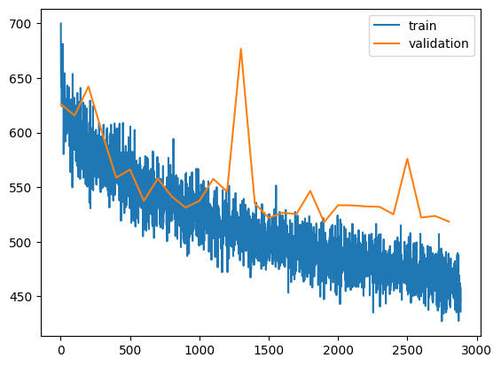
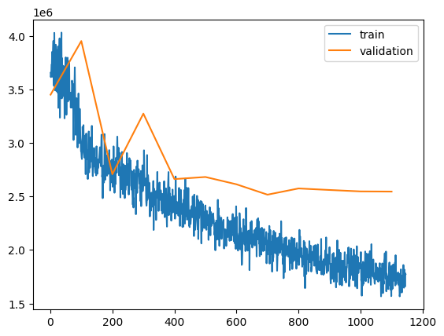

# What is this
This is a AI based Chess Game

# TO DO
- [x] Make a sklearn based model
- [x] Make a UI in pygame or js or something (using llm)
- [x] Make a basic model with pytorch, maybe ANN
- [ ] Improve the chess engine so that it can consistently beat me 
- [ ] Reinforcement Learning based ?
  
# Current Status

The model overfits. 

Model with Smooth L1 loss, l2 and dropout regularisation, AdamW, Trapezoidal scheduler, 32 embedding, train-val = 1M, 10K, bs=10K, warmup=30

Model with MSE loss, l2 and dropout regularisation, AdamW, Trapezoidal scheduler, 32 embedding, train-val = 1M, 10K, bs=10K, warmup=300
